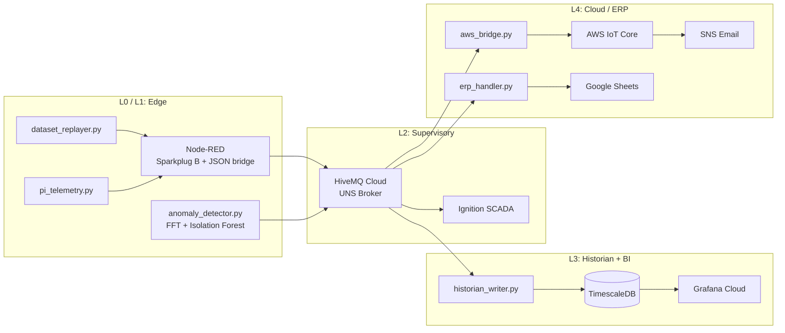
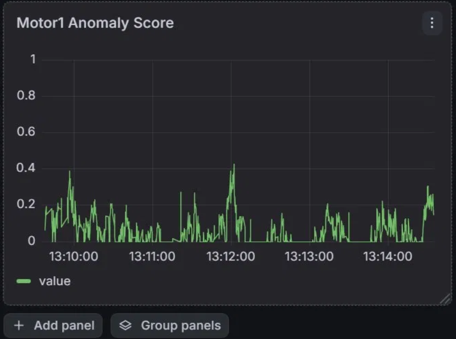
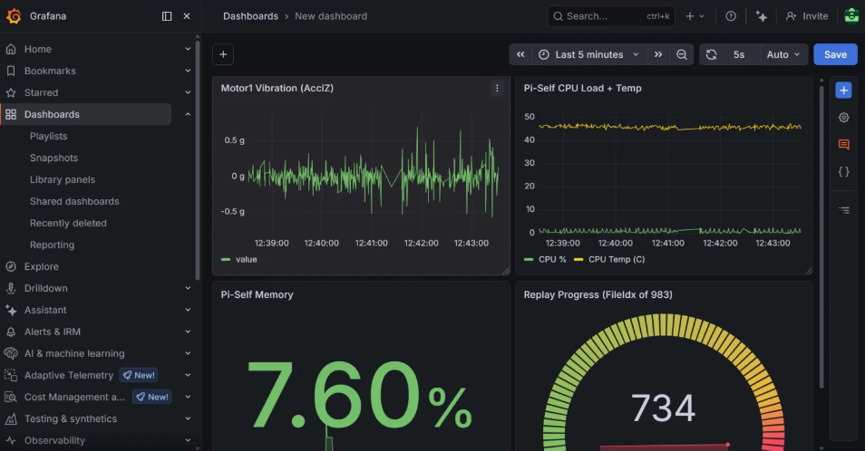
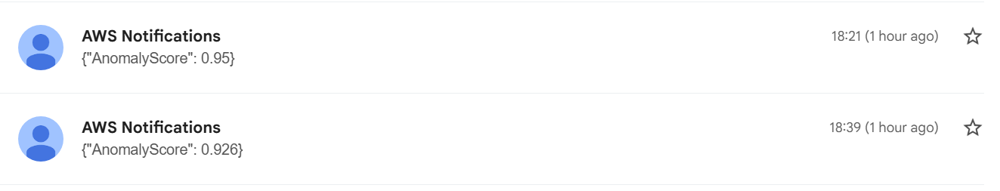
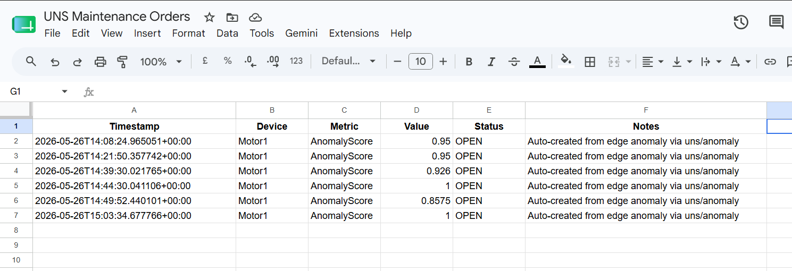
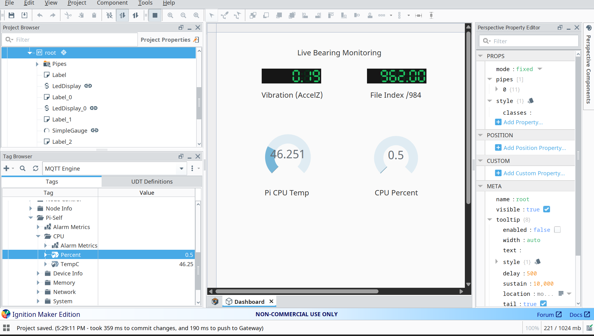
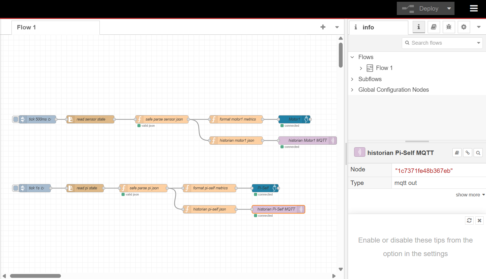

> **Repo layers.** This repo is a Unified Namespace IIoT platform with two layers:
> - **Smart Packaging Line** (this README): machine condition monitoring with edge ML.
> - **Energy Intelligence Layer**: power and energy-quality monitoring. See [`eil/`](eil/).


# Smart Packaging Line: UNS IIoT Pipeline

End-to-end Industrial IoT pipeline implementing ISA-95 L0 to L4 as a Unified Namespace, with edge ML anomaly detection on a Raspberry Pi 4. The NASA IMS Bearing Dataset is replayed through the full pipeline (edge to ERP) as a digital stand-in for a real packaging line motor.

## Architecture



## Demo

Motor1 anomaly score climbing as the NASA bearing degrades through Test 2:



Full Grafana dashboard with vibration, Pi telemetry, memory, and replay progress:



Email alert triggered automatically via AWS IoT Rule → SNS when anomaly exceeds 0.85:



Google Sheets work order row created automatically by `erp_handler.py` on the same anomaly event:



Ignition SCADA dashboard subscribing to Sparkplug B tags from the broker:



Node-RED flows handling Sparkplug B encoding for Ignition and a parallel JSON bridge for the historian:




## Tech Stack

**Edge (Raspberry Pi 4):** Python (numpy, scikit-learn, paho-mqtt, joblib), Node-RED with `node-red-contrib-sparkplug-plus`, systemd

**Broker:** HiveMQ Cloud (MQTT 5, TLS)

**SCADA:** Inductive Automation Ignition Maker Edition 8.3.6 with Cirrus Link MQTT Engine

**Historian:** TimescaleDB on Docker (PostgreSQL 16 + Timescale extension)

**BI / Dashboards:** Grafana Cloud, reached via ngrok TCP tunnel to the local TimescaleDB

**Cloud:** AWS IoT Core (X.509 cert auth), AWS SNS

**ERP:** Google Sheets via `gspread` and a service account

**Edge ML:** Isolation Forest trained on FFT magnitude features of healthy baseline vibration data (NASA IMS Test 2, channel 0)

## What's Running Where

**Raspberry Pi 4:**
- `dataset_replayer.py`: reads NASA IMS Test 2 files at 20 kHz, downsamples to 100 Hz, maintains a 256-sample sliding window, writes state files to `/tmp`
- `pi_telemetry.py`: publishes Pi self-metrics (CPU, temp, memory, load, network) every second
- `anomaly_detector.py`: reads the FFT window from `/tmp`, scores with Isolation Forest, publishes the normalized anomaly score to MQTT (runs as `uns-anomaly` systemd service)
- Node-RED: two parallel flow paths, one publishing proper Sparkplug B for Ignition, one publishing plain JSON for the historian

**Laptop (Windows):**
- TimescaleDB in a Docker container
- `historian_writer.py`: MQTT subscriber, decodes JSON bridge messages, inserts into a `sensor_data` hypertable
- `aws_bridge.py`: subscribes to HiveMQ `uns/anomaly` and republishes to AWS IoT Core, with a 5-minute in-memory cooldown
- `erp_handler.py`: subscribes to anomaly alerts and writes work order rows to a Google Sheet
- ngrok TCP tunnel forwarding port 5432 so Grafana Cloud can reach the local TimescaleDB

**Cloud:**
- AWS IoT Thing + X.509 cert + IoT policy
- AWS IoT Rule: `SELECT * FROM 'uns/anomaly' WHERE AnomalyScore > 0.85` triggering SNS
- SNS topic with confirmed email subscription
- Google Sheets accessed via a service account

## Project Structure

```
uns-iiot/
├── scripts/
│   ├── dataset_replayer.py       # NASA IMS replay, writes state to /tmp
│   ├── pi_telemetry.py           # Pi self-metrics publisher
│   ├── anomaly_detector.py       # Edge ML inference
│   ├── extract_baseline.py       # One-shot baseline feature extraction
│   ├── historian_writer.py       # MQTT to TimescaleDB
│   ├── aws_bridge.py             # HiveMQ to AWS IoT, with cooldown
│   ├── erp_handler.py            # Anomaly events to Google Sheets
│   └── iot-policy.json           # AWS IoT policy template
├── notebooks/
│   └── IIoT_Isolation_Forest.ipynb   # Isolation Forest training in Colab
├── docs/
│   ├── aws_iot_endpoint.txt
│   ├── aws_iot_rule_uns_anomaly_alert.json
│   └── aws_region.txt
└── .gitignore

```

## Key Technical Decisions

**Proper Sparkplug B, not raw JSON.** The initial build used JSON over MQTT with Sparkplug-style topic names. Switched mid-project to actual Sparkplug B protobuf encoding via `node-red-contrib-sparkplug-plus`, which is the encoding Ignition's MQTT Engine actually expects. Eclipse Tahu was used on the Python side. A parallel JSON bridge flow was kept in Node-RED so the historian and other Python consumers do not need to decode protobuf.

**Edge inference, not cloud.** FFT and Isolation Forest both run on the Pi. Only the normalized anomaly score (one float) is published, not the raw vibration window. Keeps bandwidth low and keeps the ML logic next to the data.

**Baseline-calibrated score normalization.** Isolation Forest's `score_samples()` returns raw values in a narrow band that depends entirely on the training data. The conventional `[-0.5, 0]` linear mapping does not work in general. This implementation hardcodes the training baseline mean and min into the detector, so normal data maps to ~0 anomaly and anything meaningfully below the baseline min maps toward 1. Without this, normal baseline data on this dataset registered at ~0.9 anomaly and constantly tripped the alarm threshold.

**In-memory alert cooldown.** The AWS bridge enforces a 5-minute cooldown between SNS forwards so that a degrading bearing publishing alerts every 200 ms does not spam the email inbox. Realistic industrial deduplication, kept simple as in-memory state.

**ngrok tunnel for Grafana Cloud.** Grafana Cloud cannot reach a Docker container on a laptop directly. ngrok provides a public TCP forwarding address that proxies into port 5432 locally. The Grafana data source points at the ngrok hostname. ngrok free tier rotates the hostname each session, so the data source needs updating between runs.

## Configuration

Scripts read all credentials from environment variables. Required:

```
HIVEMQ_PASS
DB_PASSWORD
```

Optional, with sensible defaults:

```
HIVEMQ_BROKER, HIVEMQ_PORT, HIVEMQ_USER
DB_HOST, DB_PORT, DB_NAME, DB_USER
AWS_IOT_ENDPOINT, AWS_CA, AWS_CERT, AWS_KEY
GOOGLE_SERVICE_ACCOUNT_FILE, GOOGLE_SHEET_NAME
ALERT_COOLDOWN_SECONDS, ERP_COOLDOWN_SECONDS
```

Cert files (`certs/`) and Google service account JSON (`credentials/`) must be provided locally. Both directories are gitignored.

## Setup Notes

Not a clone-and-run project. Standing the full pipeline up requires accounts, hardware, and software outside this repo:

1. HiveMQ Cloud free tier cluster
2. Raspberry Pi 4 with the NASA IMS Bearing Dataset (Test 2) on disk
3. Local Docker for TimescaleDB
4. Inductive Automation Ignition Maker Edition install
5. Grafana Cloud free account
6. AWS account with IoT Core, SNS access
7. Google Cloud project with a service account for the Sheets API
8. ngrok account (free tier, TCP endpoints require card-on-file verification)

The repo is the source of truth for the scripts, the IoT rule, and the AWS IoT policy. Everything else is environment.

## Known Limitations

- Replayer always restarts from `FileIdx 0`, no resume state persisted across runs
- AWS bridge cooldown is in-memory and resets on bridge restart
- ngrok free tier rotates the TCP forwarding endpoint per session, Grafana data source needs updating between runs
- Single bearing channel monitored (channel 0 of NASA IMS Test 2)
- Model retraining is manual, not on a schedule

Built to map the full L0 to L4 industrial automation stack end-to-end on consumer-grade hardware.
