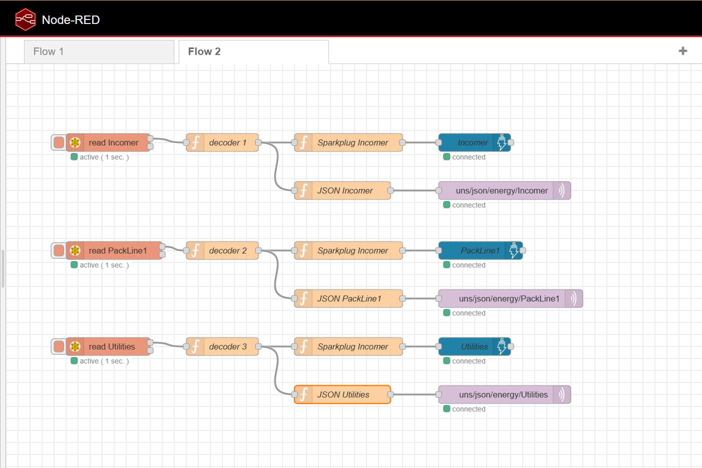
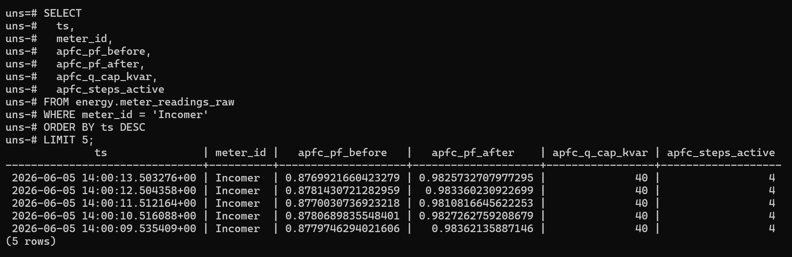
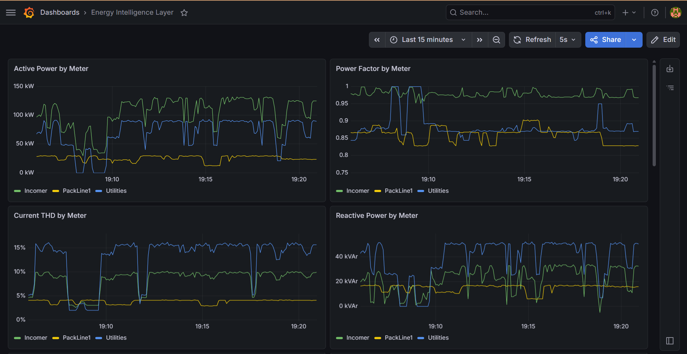
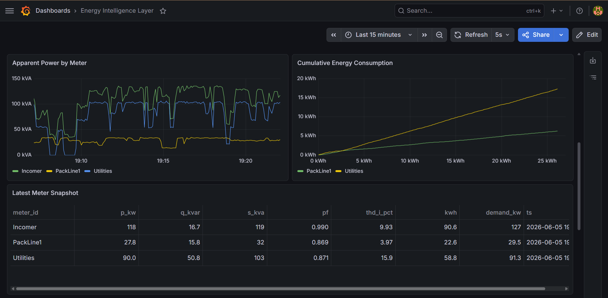
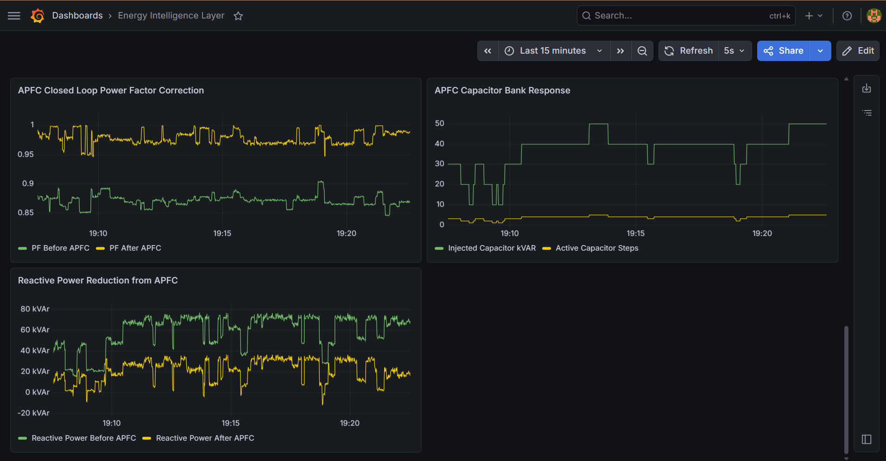
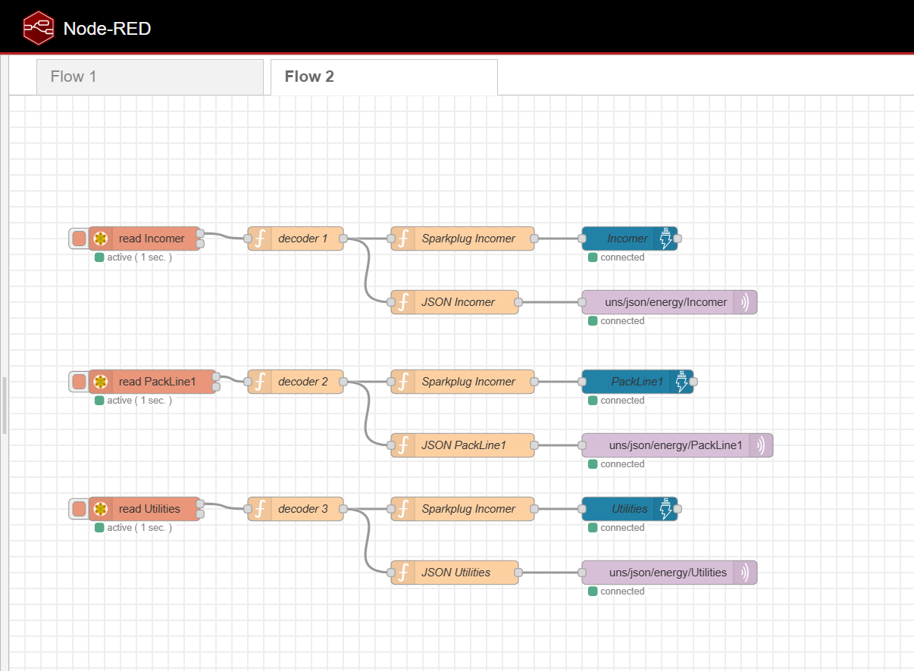

# Energy Intelligence Layer (EIL)

Power and energy-quality monitoring built on top of the UNS IIoT pipeline. Same spine as the rest of the project (Node-RED, Sparkplug B, HiveMQ, TimescaleDB, Grafana), pointed at the electrical system instead of machine condition: voltage, current, real and reactive power, power factor, harmonics, energy, and demand across a simulated plant single-line.

## Pipeline

```
SENTRON PAC3220 emulator (Modbus TCP)
  -> Node-RED: Modbus poll @1Hz + float32 decode
  -> dual publish: Sparkplug B (UNS) + plain JSON (historian)
  -> HiveMQ Cloud
  -> TimescaleDB (energy schema)
  -> Grafana
```



The field layer is a Python emulator of a Siemens SENTRON PAC3220, exposing three meters as Modbus unit IDs:

- unit 1, Incomer: main LV switchgear, the aggregate
- unit 2, PackLine1: line feeder, cleaner load
- unit 3, Utilities: compressor / chiller / VFD feeder, lower PF and higher current THD

Values are float32 across register pairs, polled at 1 Hz and decoded in Node-RED. The register layout follows the SENTRON PAC float32 convention; it is not verified byte-for-byte against the official PAC3220 manual.

## Energy model

Energy lives in its own branch that follows the electrical single-line, not the ISA-95 production hierarchy. The two don't line up: a feeder powers parts of several machines, and a machine can sit across phases. So the tree is:

```
Energy/Incomer/...
Energy/DB1/PackLine1/...
Energy/DB1/Utilities/...
```

Energy intensity (kWh per unit produced) comes from cross-referencing the energy and production trees on time, not from merging them.

## Storage

TimescaleDB, with a dedicated energy schema:

- `energy.meter_readings_raw` hypertable, 1 s resolution
- 1-minute and 1-hour continuous aggregates
- columnstore compression
- 30-day raw retention



## Dashboards

Local Grafana querying TimescaleDB.





## PFC monitoring (harmonic-aware)

A supervisory power-factor-correction layer that models an APFC capacitor bank in simulation. It monitors and advises, it does not actuate. In a real install the correction is done by a self-contained relay at the LV main, and nothing here switches anything in the field.

Two things it does that a plain cos-phi relay doesn't:

- Watches the cap bank for silent failures. Capacitors lose capacitance, fuses blow, a step drops out, and PF drifts before anyone notices. This catches a dead or degraded step when it happens.
- Switches with harmonics in mind. It tracks the resonance order as steps energize (`h_r ~= sqrt(S_sc / Q_c)`) and holds off any step that would push resonance near the 5th, 7th, or 11th harmonic from 6-pulse VFD loads, with detuned reactors modeled as the fix. That resonance case is what actually blows capacitors on a drive-heavy bus, and a standard relay is blind to it.

The sim runs the loop end to end (steps switch, PF corrects), and the before/after PF shows up in Grafana.



## Possible extensions

Scoped but left out of this build:

- Tariff/cost layer: turn PF, kVARh, and demand into money, with time-of-use awareness, to put a number on waste.
- Capacitor-bank PdM: track step health over time and forecast failures instead of just flagging them.
- 24h demand forecast (LightGBM) for load shifting and demand-charge avoidance.
- Energy anomaly detection, reusing the Isolation Forest approach from the vibration side on consumption and power-quality baselines.
- Drop-in real hardware: swap the emulator for a real meter (PAC3220 over Modbus, or a Shelly 3EM) with nothing above the field layer changing.

## Stack

Python, pymodbus 3.6.9, Node-RED (`node-red-contrib-modbus`, `node-red-contrib-mqtt-sparkplug-plus`), HiveMQ Cloud, TimescaleDB, Grafana.

## Running it

1. Start the emulator on the Node-RED host: `python3 sentron_emulator_apfc.py` (listens on `0.0.0.0:5020`).
2. Import the flows from `node-red-flows/` and deploy.
3. Load the schema: `psql -U postgres -d uns -f sql/energy_schema.sql`.
4. Start the historian: `python scripts/energy_historian_writer.py` (DB and broker creds come from env vars).
5. Import the dashboards from `grafana/`.
